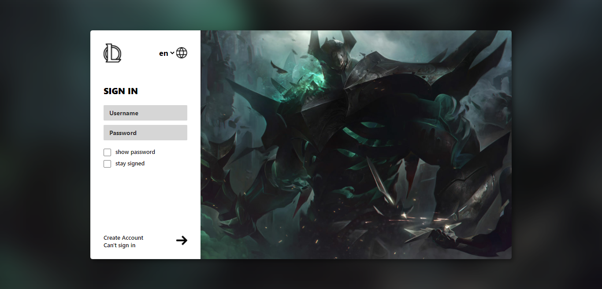

# LOL-login-clone

### sobre:
Esse projeto é uma copia da tela de loguin do jogo League of Legends,porém doram adicionadas algumas funcionalidades a mais como dark mode e tradução

### tecnologias ultilizadas:
- HTML
- CSS
- JavaScript
- FIGMA

### aprendizados com o projeto:
nesse projeto eu consegui aplicar fundamentos de media query, formatação de strings, funções e manipulação do DOM

### considerações finais:
- para acessar o darkmode é preciso clicar na logo do League of Legends
- visualizar projeto: https://matheuscoffers.github.io/LOL-login-clone/

